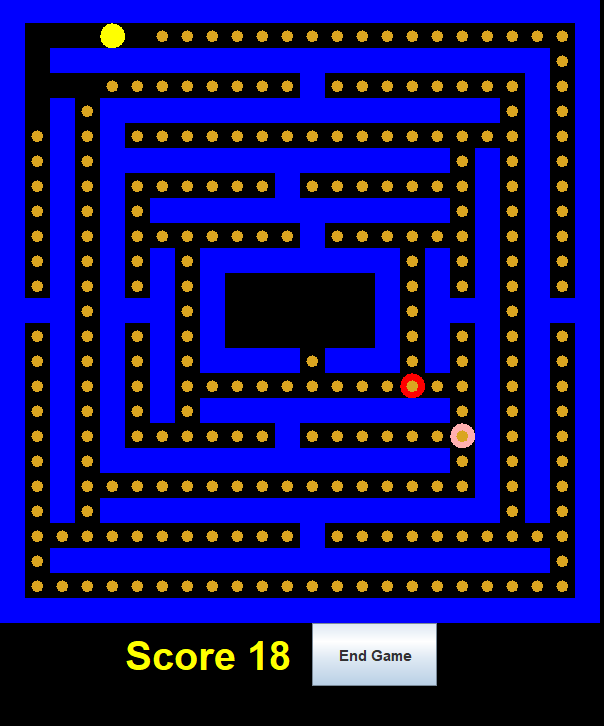

# Project 2: PacMan

By: Myckell Ronquillo, Ryan Gorinson, Evan Nadelbach, Joseph Zietowski



## Table of Contents
[How to play](#how-to-play)  
[Methods](#Methods)  


## How to play
*First, compile the program using the line below*
```bash
javac -cp "src/" src/*.java
```
*Then, start the game by running this line:*
```bash
java -cp "src/" StartMenu
```

## Methods

### Pacman - get_valid_moves()
- **Description**: This method returns all the possible valid moves that PacMan can take given his current location
- **Test**: The test places PacMan in a location where the only 3 possible moves
### Pacman - move()
- **Description**: This method randomly chooses a valid move from get_valid_moves() method and moves PacMan to that valid move
- **Test**: The test checks to see if PacMan moved to a new location by checking the map that there is a type PacMan in the new location that he moved to
### Pacman - is_ghost_in_range()
- **Description**: This method checks to see if there are any ghosts adjacent to PacMan's current location
- **Test**: The test first checks to see if a ghost is next to PacMan and returns false and a ghost is then added next to PacMan and is_ghost_in_range() method is called again and returns True since there is a ghost next to PacMan
### Pacman - consume()
- **Description**: This method calls the Map class to consume the cookie that Pacman is on. If a cookie is not at the same location as Pacman, this method will return null. Otherwise, it will return the cookie JComponent consumed.
- **Test**: This test adds Pacman to a location with a cookie and makes sure the cookie is consumed and returned. Then, this test moves Pacman to a location without a cookie and makes sure that consume() returns null.

### Ghost - get_valid_moves()
- **Description**: This method retrieves all of the possible moves that a ghost can make. Ghosts can move up, down, left, and right, and can also move diagonally. Because of this, ghosts can move in a maximum of 8 possible directions. As long as the location is not a wall, it can move there.
- **Test**: The test places a ghost in location (1, 1) and ensures that it only has two valid locations it can move to (based on map.txt).
### Ghost - move()
- **Description**: This method moves a ghost to one of the valid locations returned by get_valid_moves. It does this using a random number generator and will return true if there is at least one valid location the ghost can move to.
- **Test**: The test ensures that there is a valid move for a ghost at position (1, 1) to move to, and checks that it did indeed move to one of those locations. There are a total of two positions it could move to (based on map.txt).
### Ghost - is_pacman_in_range()
- **Description**: This method checks to see if Pac-Man is in one of the eight directions (up, down, left, right, and diagonal) from a ghost in a given location. If Pac-Man is in at least one of those locations, this method returns true, and otherwise it returns false.
- **Test**: This test checks to see if there is a Pac-Man in a given location based on a ghost at location (1, 1). The first assertion checks that Pac-Man is not in range (which is correct since a Pac-Man was not added anywhere), then the second assertion checks that Pac-Man is in range when added at location (1, 2).
### Ghost - attack()
- **Description**: This method gets the ghost to attack Pacman and returns true of the attack was successful. Pacman must be in range of the ghost for the attack to be successful. This method calls is_pacman_in_range() to test for this.
- **Test**: This test adds a ghost next to Pacman, calls attack(), and then makes sure that the attack was successful. Next, the test moves the ghost away from Pacman and makes sure that attack() returns false.

### Map - move(String name, Location loc, Type type)
- **Description**: This method takes in a name, location, and Type, and moves the corresponding component to the provided location while removing it from its previous location. To do this, it needs to update three fields in the Map class (locations, components, field). For this method to work, there needs to be an existing component with the name and type provided.
- **Test**: This test creates a ghost and moves it to a new location by calling move(). It then makes sure that the ghost was moved properly and that it has been removed from its initial position.
### Map - getLoc(Location Loc)
- **Description**: For the given location argument, This method returns what is currently at the location (Empty, Pacman, Cookie, Ghost, Wall).
- **Test**: The test checks to see if a previously inserted element at (x,y) gets correctly returned from the location loc 
### Map - attack(String name)
- **Description**: The method controls ghosts attacking pacman. If the ghost was able to successfully attack pacman and update the display to do so return true, otherwise return false.
- **Test**: If a ghost is within 1 x/y coordinate from pacman, the test will return true verifying that pacman has been attacked
### Map - eatCookie(String Name)
- **Description**: The method controls Pacman eating a cookie. When the method is able to successfully update display to eat a cookie it returns the Cookie component that has been eaten, otherwise it returns null.
- **Test**: The test makes sure that if pacman is at x,y and cookie is not at x,y then it will return null. It also verifies that there will be a return value if the cookies coordinates = pacmans coordinates
